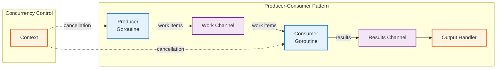
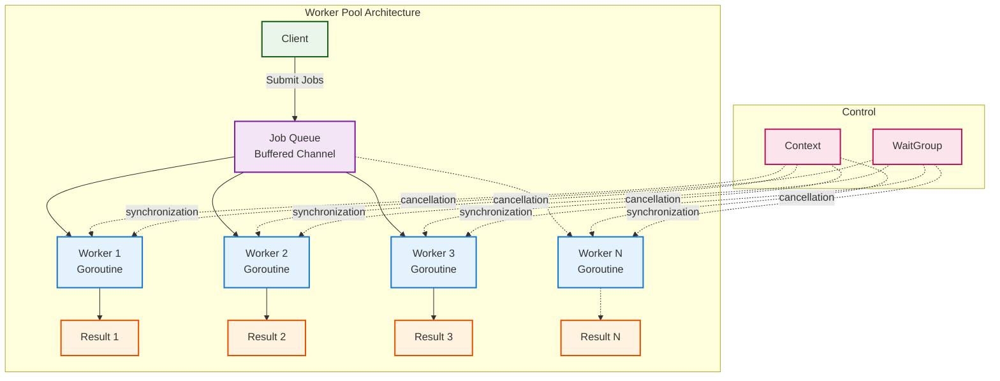
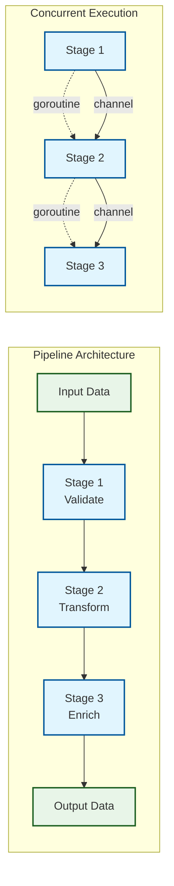

# Go Concurrency Guide: Patterns, Practices, and Principles

## Table of Contents

1. [Introduction](#introduction)
2. [Foundational Concepts](#foundational-concepts)
3. [Core Channel Patterns](#core-channel-patterns)
   - [Producer-Consumer Pattern](#1-producer-consumer-pattern)
   - [Fan-Out/Fan-In Pattern](#2-fan-outfan-in-pattern)
   - [Worker Pool Pattern](#3-worker-pool-pattern)
   - [Generator Pattern](#4-generator-pattern)
4. [Advanced Concurrency Patterns](#advanced-concurrency-patterns)
5. [Context and Cancellation](#context-and-cancellation)
6. [Synchronization Primitives](#synchronization-primitives)
7. [Pipeline Architecture](#pipeline-architecture)
8. [Clean Architecture Integration](#clean-architecture-integration)
9. [Performance and Memory Considerations](#performance-and-memory-considerations)
10. [Testing Concurrent Code](#testing-concurrent-code)
11. [Common Pitfalls and Solutions](#common-pitfalls-and-solutions)
12. [Best Practices](#best-practices)

---

## Introduction

Go's concurrency model, built around goroutines and channels, enables the creation
of highly concurrent, scalable applications. This guide synthesizes advanced patterns
with foundational principles, ensuring your concurrent code aligns with Clean
Architecture, Domain-Driven Design (DDD), and CQRS principles.

### Philosophy

> "Don't communicate by sharing memory; share memory by communicating." - Rob Pike

This principle guides Go's approach to concurrency, emphasizing message passing
over shared state. When applied to Clean Architecture, this translates to:

- **Domain Layer**: Pure business logic with no concurrency concerns
- **Application Layer**: Orchestrates concurrent operations through use cases
- **Infrastructure Layer**: Implements concurrent data access and external communication

---

## Foundational Concepts

### Goroutines: Lightweight Threads

Goroutines are multiplexed onto multiple OS threads, making them extremely lightweight:

```go
// Simple goroutine creation
go func() {
    fmt.Println("Hello from goroutine")
}()

// Goroutine with parameters
go processOrder(orderID, customerID)
```

### Channels: Communication Primitives

Channels are typed conduits for communication between goroutines:

```go
// Unbuffered channel (synchronous)
ch := make(chan string)

// Buffered channel (asynchronous up to buffer size)
ch := make(chan string, 10)

// Directional channels
func sender(ch chan<- string) { /* send only */ }
func receiver(ch <-chan string) { /* receive only */ }
```

---

## Core Channel Patterns

### 1. Producer-Consumer Pattern

Essential for decoupling data generation from processing:



```go
// Producer generates work items
func producer(ctx context.Context, work chan<- WorkItem) {
    defer close(work)

    for {
        select {
        case <-ctx.Done():
            return
        case work <- generateWork():
            // Work item sent
        }
    }
}

// Consumer processes work items
func consumer(ctx context.Context, work <-chan WorkItem, results chan<- Result) {
    defer close(results)

    for {
        select {
        case <-ctx.Done():
            return
        case item, ok := <-work:
            if !ok {
                return // Channel closed
            }
            result := processWork(item)
            select {
            case results <- result:
            case <-ctx.Done():
                return
            }
        }
    }
}
```

### 2. Fan-Out/Fan-In Pattern

Distributes work across multiple workers and collects results:

```go
// Fan-out: Distribute work to multiple workers
func fanOut(ctx context.Context, input <-chan Work, workers int) []<-chan Result {
    outputs := make([]<-chan Result, workers)

    for i := 0; i < workers; i++ {
        output := make(chan Result)
        outputs[i] = output

        go func() {
            defer close(output)
            for work := range input {
                select {
                case output <- processWork(work):
                case <-ctx.Done():
                    return
                }
            }
        }()
    }

    return outputs
}

// Fan-in: Collect results from multiple channels
func fanIn(ctx context.Context, inputs ...<-chan Result) <-chan Result {
    output := make(chan Result)

    var wg sync.WaitGroup
    wg.Add(len(inputs))

    for _, input := range inputs {
        go func(ch <-chan Result) {
            defer wg.Done()
            for result := range ch {
                select {
                case output <- result:
                case <-ctx.Done():
                    return
                }
            }
        }(input)
    }

    go func() {
        wg.Wait()
        close(output)
    }()

    return output
}
```

### 3. Worker Pool Pattern

Manages a fixed number of workers for controlled resource usage:



```go
type WorkerPool struct {
    workers   int
    jobQueue  chan Job
    quit      chan struct{}
    wg        sync.WaitGroup
}

func NewWorkerPool(workers int, queueSize int) *WorkerPool {
    return &WorkerPool{
        workers:  workers,
        jobQueue: make(chan Job, queueSize),
        quit:     make(chan struct{}),
    }
}

func (wp *WorkerPool) Start(ctx context.Context) {
    for i := 0; i < wp.workers; i++ {
        wp.wg.Add(1)
        go wp.worker(ctx)
    }
}

func (wp *WorkerPool) worker(ctx context.Context) {
    defer wp.wg.Done()

    for {
        select {
        case job := <-wp.jobQueue:
            job.Execute()
        case <-ctx.Done():
            return
        case <-wp.quit:
            return
        }
    }
}

func (wp *WorkerPool) Submit(job Job) bool {
    select {
    case wp.jobQueue <- job:
        return true
    default:
        return false // Queue full
    }
}

func (wp *WorkerPool) Stop() {
    close(wp.quit)
    wp.wg.Wait()
}
```

### 4. Generator Pattern

Generators are functions that launch their own goroutine, stream values through
a channel, and close that channel when finished. They provide excellent separation
of concerns and natural back-pressure handling.

**Key Benefits:**

- **Separation of concerns** — data creation lives separately from processing
- **Lazy evaluation** — values appear only when demanded, saving time and memory
- **Infinite sequences** — can emit data forever without storing anything
- **Built-in back-pressure** — if consumer slows down, channel blocks and producer throttles automatically

#### Simple Generator Example

```go
// cubes streams the cube of each integer up to 'limit'
func cubes(limit int) <-chan int {
    out := make(chan int)
    go func() {
        defer close(out) // Always close the channel
        for n := 1; n <= limit; n++ {
            out <- n * n * n
        }
    }()
    return out
}

// Usage: immediate streaming without waiting for all results
func main() {
    for cube := range cubes(6) {
        fmt.Println("Cube:", cube)
        // Each cube appears immediately as it's calculated
    }
}
```

#### Real-Time Data Generator

```go
// forexFeed simulates endless stream of exchange rates
func forexFeed(ctx context.Context, pair string) <-chan float64 {
    out := make(chan float64)
    go func() {
        defer close(out)
        for {
            select {
            case <-ctx.Done():
                return
            default:
                rate := 1.05 + rand.Float64()*0.02 // simulated quote
                select {
                case out <- rate:
                case <-ctx.Done():
                    return
                }
                time.Sleep(300 * time.Millisecond)
            }
        }
    }()
    return out
}

// Usage with context cancellation
func monitorForex() {
    ctx, cancel := context.WithTimeout(context.Background(), 10*time.Second)
    defer cancel()

    for quote := range forexFeed(ctx, "EUR/USD") {
        fmt.Printf("Quote: %.5f\n", quote)
        if quote > 1.07 {
            fmt.Println("Target reached, exiting")
            break
        }
    }
}
```

#### File Tailing Generator

```go
// follow tails a file and streams new lines as they appear
func follow(ctx context.Context, path string) (<-chan string, <-chan error) {
    lines := make(chan string)
    errors := make(chan error, 1)

    go func() {
        defer close(lines)
        defer close(errors)

        f, err := os.Open(path)
        if err != nil {
            errors <- err
            return
        }
        defer f.Close()

        reader := bufio.NewReader(f)
        for {
            select {
            case <-ctx.Done():
                return
            default:
                line, err := reader.ReadString('\n')
                if err != nil && err != io.EOF {
                    errors <- err
                    return
                }
                if len(line) > 0 {
                    select {
                    case lines <- strings.TrimSuffix(line, "\n"):
                    case <-ctx.Done():
                        return
                    }
                }
                time.Sleep(150 * time.Millisecond)
            }
        }
    }()

    return lines, errors
}

// Usage with error handling
func tailLogs() {
    ctx, cancel := context.WithCancel(context.Background())
    defer cancel()

    lines, errors := follow(ctx, "server.log")

    for {
        select {
        case line, ok := <-lines:
            if !ok {
                return
            }
            fmt.Println("New log:", line)
        case err := <-errors:
            if err != nil {
                log.Printf("Error tailing file: %v", err)
                return
            }
        case <-ctx.Done():
            return
        }
    }
}
```

#### Generator Best Practices

1. **Always close the channel** — Use `defer close(out)` to prevent consumer blocking
2. **Handle context cancellation** — Respect cancellation in infinite generators
3. **Separate error channels** — Don't mix data and errors in the same channel
4. **Resource cleanup** — Pair every `Open` with `Close`, handle goroutine cleanup
5. **Consider buffering** — Small buffers can improve performance without much memory cost

```go
// Template for robust generator
func robustGenerator[T any](ctx context.Context, params GeneratorParams) (<-chan T, <-chan error) {
    data := make(chan T, 10) // Small buffer for performance
    errors := make(chan error, 1)

    go func() {
        defer close(data)
        defer close(errors)
        defer cleanup() // Resource cleanup

        for {
            select {
            case <-ctx.Done():
                return
            default:
                item, err := generateItem(params)
                if err != nil {
                    errors <- err
                    return
                }

                select {
                case data <- item:
                case <-ctx.Done():
                    return
                }
            }
        }
    }()

    return data, errors
}
```

---

## Advanced Concurrency Patterns

### 1. Rate Limiting

Controls the rate of operations to prevent resource exhaustion:

```go
// Token bucket rate limiter
type RateLimiter struct {
    tokens chan struct{}
    ticker *time.Ticker
    done   chan struct{}
}

func NewRateLimiter(rate time.Duration, burst int) *RateLimiter {
    rl := &RateLimiter{
        tokens: make(chan struct{}, burst),
        ticker: time.NewTicker(rate),
        done:   make(chan struct{}),
    }

    // Fill initial bucket
    for i := 0; i < burst; i++ {
        rl.tokens <- struct{}{}
    }

    // Refill tokens
    go func() {
        defer rl.ticker.Stop()
        for {
            select {
            case <-rl.ticker.C:
                select {
                case rl.tokens <- struct{}{}:
                default: // Bucket full
                }
            case <-rl.done:
                return
            }
        }
    }()

    return rl
}

func (rl *RateLimiter) Allow(ctx context.Context) error {
    select {
    case <-rl.tokens:
        return nil
    case <-ctx.Done():
        return ctx.Err()
    }
}

func (rl *RateLimiter) Close() {
    close(rl.done)
}
```

### 2. Circuit Breaker

Prevents cascading failures in distributed systems:

```go
type CircuitState int

const (
    StateClosed CircuitState = iota
    StateOpen
    StateHalfOpen
)

type CircuitBreaker struct {
    mu              sync.RWMutex
    state           CircuitState
    failureCount    int
    lastFailureTime time.Time
    threshold       int
    timeout         time.Duration
}

func NewCircuitBreaker(threshold int, timeout time.Duration) *CircuitBreaker {
    return &CircuitBreaker{
        state:     StateClosed,
        threshold: threshold,
        timeout:   timeout,
    }
}

func (cb *CircuitBreaker) Execute(fn func() error) error {
    if !cb.allowRequest() {
        return errors.New("circuit breaker is open")
    }

    err := fn()
    cb.recordResult(err)
    return err
}

func (cb *CircuitBreaker) allowRequest() bool {
    cb.mu.RLock()
    defer cb.mu.RUnlock()

    switch cb.state {
    case StateClosed:
        return true
    case StateOpen:
        return time.Since(cb.lastFailureTime) >= cb.timeout
    case StateHalfOpen:
        return true
    default:
        return false
    }
}

func (cb *CircuitBreaker) recordResult(err error) {
    cb.mu.Lock()
    defer cb.mu.Unlock()

    if err != nil {
        cb.failureCount++
        cb.lastFailureTime = time.Now()

        if cb.failureCount >= cb.threshold {
            cb.state = StateOpen
        }
    } else {
        cb.failureCount = 0
        cb.state = StateClosed
    }
}
```

### 3. Timeout Pattern

Ensures operations complete within acceptable time limits:

```go
func withTimeout[T any](ctx context.Context, timeout time.Duration, operation func() (T, error)) (T, error) {
    ctx, cancel := context.WithTimeout(ctx, timeout)
    defer cancel()

    type result struct {
        value T
        err   error
    }

    resultChan := make(chan result, 1)

    go func() {
        value, err := operation()
        resultChan <- result{value, err}
    }()

    select {
    case res := <-resultChan:
        return res.value, res.err
    case <-ctx.Done():
        var zero T
        return zero, ctx.Err()
    }
}

// Usage example
func fetchUserData(userID string) (*User, error) {
    return withTimeout(context.Background(), 5*time.Second, func() (*User, error) {
        return userService.GetUser(userID)
    })
}
```

---

## Context and Cancellation

Context is essential for managing goroutine lifecycles and request-scoped values:

### Context Propagation

```go
// HTTP handler with context propagation
func handleRequest(w http.ResponseWriter, r *http.Request) {
    ctx := r.Context()

    // Add request ID for tracing
    requestID := generateRequestID()
    ctx = context.WithValue(ctx, "requestID", requestID)

    // Set timeout for the entire request
    ctx, cancel := context.WithTimeout(ctx, 30*time.Second)
    defer cancel()

    result, err := processRequest(ctx, r)
    if err != nil {
        if errors.Is(err, context.DeadlineExceeded) {
            http.Error(w, "Request timeout", http.StatusRequestTimeout)
            return
        }
        http.Error(w, err.Error(), http.StatusInternalServerError)
        return
    }

    json.NewEncoder(w).Encode(result)
}

func processRequest(ctx context.Context, r *http.Request) (*Response, error) {
    // Pass context to all downstream operations
    userData, err := fetchUserData(ctx, r.Header.Get("user-id"))
    if err != nil {
        return nil, err
    }

    orders, err := fetchUserOrders(ctx, userData.ID)
    if err != nil {
        return nil, err
    }

    return &Response{User: userData, Orders: orders}, nil
}
```

### Graceful Shutdown

```go
type Server struct {
    httpServer *http.Server
    workers    *WorkerPool
    shutdown   chan struct{}
    wg         sync.WaitGroup
}

func (s *Server) Start() error {
    // Start background workers
    s.workers.Start(context.Background())

    // Start HTTP server
    s.wg.Add(1)
    go func() {
        defer s.wg.Done()
        if err := s.httpServer.ListenAndServe(); err != nil && err != http.ErrServerClosed {
            log.Printf("HTTP server error: %v", err)
        }
    }()

    return nil
}

func (s *Server) GracefulStop(timeout time.Duration) error {
    log.Println("Initiating graceful shutdown...")

    // Create shutdown context
    ctx, cancel := context.WithTimeout(context.Background(), timeout)
    defer cancel()

    // Stop accepting new requests
    if err := s.httpServer.Shutdown(ctx); err != nil {
        return fmt.Errorf("HTTP server shutdown failed: %w", err)
    }

    // Stop worker pool
    s.workers.Stop()

    // Wait for background goroutines
    done := make(chan struct{})
    go func() {
        s.wg.Wait()
        close(done)
    }()

    select {
    case <-done:
        log.Println("Graceful shutdown completed")
        return nil
    case <-ctx.Done():
        return fmt.Errorf("shutdown timeout exceeded")
    }
}
```

---

## Synchronization Primitives

### Mutex for Critical Sections

```go
type SafeCounter struct {
    mu    sync.RWMutex
    value int64
}

func (c *SafeCounter) Increment() {
    c.mu.Lock()
    defer c.mu.Unlock()
    c.value++
}

func (c *SafeCounter) Value() int64 {
    c.mu.RLock()
    defer c.mu.RUnlock()
    return c.value
}
```

### sync.Once for Initialization

```go
type DatabaseConnection struct {
    conn *sql.DB
    once sync.Once
    err  error
}

func (db *DatabaseConnection) GetConnection() (*sql.DB, error) {
    db.once.Do(func() {
        db.conn, db.err = sql.Open("postgres", connectionString)
    })
    return db.conn, db.err
}
```

### WaitGroup for Coordination

```go
func processFiles(filenames []string) error {
    var wg sync.WaitGroup
    errChan := make(chan error, len(filenames))

    for _, filename := range filenames {
        wg.Add(1)
        go func(fn string) {
            defer wg.Done()
            if err := processFile(fn); err != nil {
                errChan <- err
            }
        }(filename)
    }

    wg.Wait()
    close(errChan)

    // Check for errors
    for err := range errChan {
        if err != nil {
            return err
        }
    }

    return nil
}
```

---

## Pipeline Architecture

Pipelines process data through a series of stages, each running concurrently:



```go
// Pipeline stage definition
type Stage[In, Out any] func(ctx context.Context, in <-chan In) <-chan Out

// Pipeline builder
type Pipeline[T any] struct {
    stages []func(context.Context, <-chan T) <-chan T
}

func NewPipeline[T any]() *Pipeline[T] {
    return &Pipeline[T]{}
}

func (p *Pipeline[T]) AddStage(stage func(context.Context, <-chan T) <-chan T) *Pipeline[T] {
    p.stages = append(p.stages, stage)
    return p
}

func (p *Pipeline[T]) Execute(ctx context.Context, input <-chan T) <-chan T {
    current := input
    for _, stage := range p.stages {
        current = stage(ctx, current)
    }
    return current
}

// Example pipeline stages
func validateStage(ctx context.Context, in <-chan Order) <-chan Order {
    out := make(chan Order)
    go func() {
        defer close(out)
        for order := range in {
            if err := validateOrder(order); err != nil {
                log.Printf("Invalid order %s: %v", order.ID, err)
                continue
            }
            select {
            case out <- order:
            case <-ctx.Done():
                return
            }
        }
    }()
    return out
}

func enrichStage(ctx context.Context, in <-chan Order) <-chan Order {
    out := make(chan Order)
    go func() {
        defer close(out)
        for order := range in {
            enrichedOrder := enrichOrder(order)
            select {
            case out <- enrichedOrder:
            case <-ctx.Done():
                return
            }
        }
    }()
    return out
}

// Usage
func processOrders(ctx context.Context, orders <-chan Order) <-chan Order {
    pipeline := NewPipeline[Order]().
        AddStage(validateStage).
        AddStage(enrichStage)

    return pipeline.Execute(ctx, orders)
}
```

---

## Clean Architecture Integration

### Domain Layer (Concurrency-Agnostic)

```go
// Domain entities remain pure
type Order struct {
    ID          string
    CustomerID  string
    Items       []OrderItem
    Status      OrderStatus
    CreatedAt   time.Time
}

// Domain services focus on business logic
type OrderService interface {
    CreateOrder(order Order) error
    UpdateOrderStatus(orderID string, status OrderStatus) error
    GetOrder(orderID string) (*Order, error)
}
```

### Application Layer (Orchestrates Concurrency)

```go
// Use case coordinates concurrent operations
type ProcessOrderUseCase struct {
    orderRepo    OrderRepository
    paymentSvc   PaymentService
    inventorySvc InventoryService
    emailSvc     EmailService
}

func (uc *ProcessOrderUseCase) Execute(ctx context.Context, orderID string) error {
    order, err := uc.orderRepo.GetByID(ctx, orderID)
    if err != nil {
        return err
    }

    // Concurrent operations with error handling
    var (
        paymentErr   error
        inventoryErr error
        wg           sync.WaitGroup
    )

    // Process payment concurrently
    wg.Add(1)
    go func() {
        defer wg.Done()
        paymentErr = uc.paymentSvc.ProcessPayment(ctx, order.PaymentInfo)
    }()

    // Reserve inventory concurrently
    wg.Add(1)
    go func() {
        defer wg.Done()
        inventoryErr = uc.inventorySvc.ReserveItems(ctx, order.Items)
    }()

    wg.Wait()

    // Handle errors
    if paymentErr != nil {
        return fmt.Errorf("payment failed: %w", paymentErr)
    }
    if inventoryErr != nil {
        // Compensate: refund payment
        uc.paymentSvc.RefundPayment(ctx, order.PaymentInfo)
        return fmt.Errorf("inventory reservation failed: %w", inventoryErr)
    }

    // Send confirmation email asynchronously
    go func() {
        if err := uc.emailSvc.SendOrderConfirmation(context.Background(), order); err != nil {
            log.Printf("Failed to send confirmation email for order %s: %v", order.ID, err)
        }
    }()

    return uc.orderRepo.UpdateStatus(ctx, orderID, OrderStatusConfirmed)
}
```

### Infrastructure Layer (Implements Concurrent Access)

```go
// Repository with connection pooling
type PostgreSQLOrderRepository struct {
    db *sql.DB
}

func (r *PostgreSQLOrderRepository) GetByID(ctx context.Context, orderID string) (*Order, error) {
    // Database handles connection pooling and concurrent access
    row := r.db.QueryRowContext(ctx, "SELECT id, customer_id, status, created_at FROM orders WHERE id = $1", orderID)

    var order Order
    err := row.Scan(&order.ID, &order.CustomerID, &order.Status, &order.CreatedAt)
    if err != nil {
        return nil, err
    }

    return &order, nil
}

// Event publisher with buffered channels
type EventPublisher struct {
    events chan Event
    quit   chan struct{}
    wg     sync.WaitGroup
}

func NewEventPublisher(bufferSize int) *EventPublisher {
    ep := &EventPublisher{
        events: make(chan Event, bufferSize),
        quit:   make(chan struct{}),
    }

    ep.wg.Add(1)
    go ep.processEvents()

    return ep
}

func (ep *EventPublisher) Publish(event Event) {
    select {
    case ep.events <- event:
    default:
        log.Printf("Event buffer full, dropping event: %+v", event)
    }
}

func (ep *EventPublisher) processEvents() {
    defer ep.wg.Done()

    for {
        select {
        case event := <-ep.events:
            ep.handleEvent(event)
        case <-ep.quit:
            return
        }
    }
}
```

---

## Performance and Memory Considerations

### Channel Buffer Sizing

```go
// Unbuffered: Synchronous communication (blocking)
ch := make(chan Data)

// Small buffer: Reduce blocking for burst traffic
ch := make(chan Data, 10)

// Large buffer: Batch processing (be careful of memory usage)
ch := make(chan Data, 1000)

// Calculated buffer: Based on expected throughput
expectedThroughput := 1000 // operations per second
processingTime := 50 * time.Millisecond
bufferSize := int(float64(expectedThroughput) * processingTime.Seconds())
ch := make(chan Data, bufferSize)
```

### Memory Management

```go
// Avoid goroutine leaks with proper cleanup
func processWithTimeout(ctx context.Context, data []byte) error {
    done := make(chan error, 1) // Buffered to prevent goroutine leak

    go func() {
        // Expensive operation
        result := heavyProcessing(data)
        done <- result
    }()

    select {
    case err := <-done:
        return err
    case <-ctx.Done():
        // Goroutine will eventually finish and write to buffered channel
        return ctx.Err()
    }
}

// Pool expensive objects
var bufferPool = sync.Pool{
    New: func() interface{} {
        return make([]byte, 4096)
    },
}

func processData(data []byte) error {
    buffer := bufferPool.Get().([]byte)
    defer bufferPool.Put(buffer)

    // Use buffer for processing
    return nil
}
```

### Resource Limiting

```go
// Semaphore pattern for limiting concurrent operations
type Semaphore struct {
    permits chan struct{}
}

func NewSemaphore(maxConcurrency int) *Semaphore {
    return &Semaphore{
        permits: make(chan struct{}, maxConcurrency),
    }
}

func (s *Semaphore) Acquire(ctx context.Context) error {
    select {
    case s.permits <- struct{}{}:
        return nil
    case <-ctx.Done():
        return ctx.Err()
    }
}

func (s *Semaphore) Release() {
    <-s.permits
}

// Usage in worker pool
func limitedWorker(ctx context.Context, sem *Semaphore, jobs <-chan Job) {
    for job := range jobs {
        if err := sem.Acquire(ctx); err != nil {
            return
        }

        go func(j Job) {
            defer sem.Release()
            j.Process()
        }(job)
    }
}
```

### Generator Performance Considerations

Generators can be highly efficient when properly implemented:

```go
// Performance insight: Generators scale remarkably well
func benchmarkGenerators() {
    // A recent benchmark spawned 1 million goroutines, each hosting
    // its own generator, on a standard laptop. Peak memory stayed
    // well below that of a thread-pool implementation.

    const numGenerators = 1_000_000
    var wg sync.WaitGroup

    start := time.Now()
    for i := 0; i < numGenerators; i++ {
        wg.Add(1)
        go func(id int) {
            defer wg.Done()

            // Simple generator
            ch := make(chan int, 1)
            go func() {
                defer close(ch)
                ch <- id * id
            }()

            // Consume result
            <-ch
        }(i)
    }

    wg.Wait()
    fmt.Printf("Created %d generators in %v\n", numGenerators, time.Since(start))
}

// Optimal buffer sizing for generators
func optimizedGenerator(ctx context.Context, batchSize int) <-chan Work {
    // Small buffer reduces blocking without excessive memory usage
    out := make(chan Work, min(batchSize/10, 100))

    go func() {
        defer close(out)

        batch := make([]Work, 0, batchSize)

        for {
            // Fill batch
            for len(batch) < batchSize {
                work := generateWork()
                if work == nil {
                    break
                }
                batch = append(batch, work)
            }

            // Send batch items
            for _, work := range batch {
                select {
                case out <- work:
                case <-ctx.Done():
                    return
                }
            }

            batch = batch[:0] // Reset slice, keep capacity

            if len(batch) == 0 {
                break // No more work
            }
        }
    }()

    return out
}
```

---

## Testing Concurrent Code

### Race Condition Detection

```bash
# Run tests with race detector
go test -race ./...
```

### Testing with Timeouts

```go
func TestConcurrentOperation(t *testing.T) {
    ctx, cancel := context.WithTimeout(context.Background(), 5*time.Second)
    defer cancel()

    done := make(chan bool)
    go func() {
        // Concurrent operation
        result := performConcurrentOperation()
        assert.Equal(t, expectedResult, result)
        done <- true
    }()

    select {
    case <-done:
        // Test completed successfully
    case <-ctx.Done():
        t.Fatal("Test timed out")
    }
}
```

### Mock Channels for Testing

```go
func TestChannelOperation(t *testing.T) {
    input := make(chan Data, 10)
    output := make(chan Result, 10)

    // Send test data
    testData := []Data{{Value: 1}, {Value: 2}, {Value: 3}}
    for _, data := range testData {
        input <- data
    }
    close(input)

    // Process data
    processChannel(input, output)

    // Verify results
    var results []Result
    for result := range output {
        results = append(results, result)
    }

    assert.Len(t, results, len(testData))
}
```

---

## Common Pitfalls and Solutions

### 1. Goroutine Leaks

**Problem**: Goroutines that never terminate

```go
// BAD: Goroutine may leak if channel is never read
func badExample() {
    ch := make(chan string)
    go func() {
        ch <- "data" // Blocks forever if no receiver
    }()
}

// GOOD: Use buffered channel or proper synchronization
func goodExample() {
    ch := make(chan string, 1) // Buffered
    go func() {
        ch <- "data" // Won't block
    }()
}
```

### 2. Data Races: The Silent Code Killer

**Problem**: When multiple goroutines access the same variable simultaneously with at least one writing, you get a data race. It's like two kids fighting over the last cookie — unpredictable and messy.

```go
// BAD: Classic data race example
var counter = 0

func increment() {
    counter++ // Not atomic - read, modify, write can be interrupted
}

func main() {
    for i := 0; i < 1000; i++ {
        go increment()
    }
    time.Sleep(1 * time.Second)
    fmt.Println(counter) // Will be some random number < 1000
}
```

**Why it fails**: The `counter++` operation involves three steps:
1. Read current value
2. Add 1 to it  
3. Write back to memory

Multiple goroutines can interfere with each other during these steps.

**Solution 1: Mutex Protection**
```go
// GOOD: Proper synchronization with mutex
var mu sync.Mutex
var counter = 0

func increment() {
    mu.Lock()
    defer mu.Unlock()
    counter++
}
```

**Solution 2: Atomic Operations (Better for Simple Cases)**
```go
// BEST: Atomic operations for simple counters
import "sync/atomic"

var counter int64

func increment() {
    atomic.AddInt64(&counter, 1) // Thread-safe, no locks needed
}

func getValue() int64 {
    return atomic.LoadInt64(&counter)
}
```

**When to use atomic vs mutex**:
- **Atomic**: Simple operations (increment, add, compare-and-swap)
- **Mutex**: Complex operations requiring multiple steps to be atomic

### 3. Deadlocks: The Eternal Standoff

**Problem**: Deadlocks occur when goroutines wait for each other indefinitely. It's like a bad first date where both people wait for the other to make the first move.

```go
// BAD: Classic deadlock scenario
var mu1, mu2 sync.Mutex

func goroutineA() {
    mu1.Lock()
    defer mu1.Unlock()
    fmt.Println("A: acquired mu1")
    
    time.Sleep(100 * time.Millisecond) // Simulate some work
    
    mu2.Lock() // Wait for mu2, but B has it
    defer mu2.Unlock()
    fmt.Println("A: acquired mu2")
}

func goroutineB() {
    mu2.Lock()
    defer mu2.Unlock()
    fmt.Println("B: acquired mu2")
    
    time.Sleep(100 * time.Millisecond) // Simulate some work
    
    mu1.Lock() // Wait for mu1, but A has it
    defer mu1.Unlock()
    fmt.Println("B: acquired mu1")
}

func main() {
    go goroutineA()
    go goroutineB()
    time.Sleep(1 * time.Second) // Neither will complete
}
```

**Prevention Strategies**:

**1. Consistent Lock Ordering**
```go
// GOOD: Always lock in the same order
func lockInOrder(mu1, mu2 *sync.Mutex) {
    // Always lock mu1 first, then mu2
    mu1.Lock()
    defer mu1.Unlock()
    
    mu2.Lock()
    defer mu2.Unlock()
    
    // Do work with both locks held
}
```

**2. Timeout-Based Locking**
```go
// GOOD: Use context with timeout
func safeOperation(ctx context.Context) error {
    ctx, cancel := context.WithTimeout(ctx, 5*time.Second)
    defer cancel()
    
    done := make(chan struct{})
    go func() {
        mu1.Lock()
        mu2.Lock()
        
        // Critical section
        
        mu2.Unlock()
        mu1.Unlock()
        close(done)
    }()
    
    select {
    case <-done:
        return nil
    case <-ctx.Done():
        return ctx.Err() // Timeout or cancellation
    }
}
```

**3. Avoid Multiple Locks When Possible**
```go
// BEST: Single lock or lock-free design
type SafeData struct {
    mu   sync.RWMutex
    data map[string]interface{}
}

func (s *SafeData) UpdateMultiple(updates map[string]interface{}) {
    s.mu.Lock()
    defer s.mu.Unlock()
    
    // Single lock protects all operations
    for k, v := range updates {
        s.data[k] = v
    }
}
```

### 4. Lock Contention: The Performance Bottleneck

**Problem**: Too many goroutines competing for the same lock creates a bottleneck, like 1000 people trying to use one bathroom.

```go
// BAD: High contention scenario
var mu sync.Mutex
var counter = 0

func heavyIncrement() {
    mu.Lock()
    defer mu.Unlock()
    
    // Expensive operation while holding lock
    time.Sleep(10 * time.Millisecond) // Simulate heavy work
    counter++
    
    // More expensive operations...
    calculateSomething()
}

func main() {
    for i := 0; i < 100; i++ {
        go heavyIncrement() // All waiting in line
    }
}
```

**Solutions**:

**1. Minimize Lock Duration**
```go
// GOOD: Do heavy work outside the lock
func efficientIncrement() {
    // Do expensive work first
    result := calculateSomething()
    
    // Quick lock for minimal work
    mu.Lock()
    counter++
    applyResult(result)
    mu.Unlock()
}
```

**2. Use Read-Write Locks for Read-Heavy Workloads**
```go
// GOOD: RWMutex for read-heavy scenarios
type SafeConfig struct {
    mu     sync.RWMutex
    config map[string]string
}

func (c *SafeConfig) Get(key string) string {
    c.mu.RLock() // Multiple readers can access simultaneously
    defer c.mu.RUnlock()
    return c.config[key]
}

func (c *SafeConfig) Set(key, value string) {
    c.mu.Lock() // Exclusive access for writes
    defer c.mu.Unlock()
    c.config[key] = value
}
```

**3. Partition Data to Reduce Contention**
```go
// BEST: Shard data to reduce lock contention
type ShardedCounter struct {
    shards []struct {
        mu    sync.Mutex
        count int64
    }
}

func NewShardedCounter(numShards int) *ShardedCounter {
    return &ShardedCounter{
        shards: make([]struct {
            mu    sync.Mutex
            count int64
        }, numShards),
    }
}

func (sc *ShardedCounter) Increment(key string) {
    shard := hash(key) % len(sc.shards)
    sc.shards[shard].mu.Lock()
    sc.shards[shard].count++
    sc.shards[shard].mu.Unlock()
}

func (sc *ShardedCounter) Total() int64 {
    var total int64
    for i := range sc.shards {
        sc.shards[i].mu.Lock()
        total += sc.shards[i].count
        sc.shards[i].mu.Unlock()
    }
    return total
}
```

### 5. Goroutine Starvation: The Hungry Goroutine

**Problem**: Some goroutines hog resources while others starve, like one person eating all the pizza while others go hungry.

```go
// BAD: Starvation scenario
var mu sync.Mutex

func greedyGoroutine() {
    for {
        mu.Lock()
        // Long operation - starves other goroutines
        heavyComputation() // Takes 100ms
        mu.Unlock()
        // No yielding - immediately tries to lock again
    }
}

func normalGoroutine() {
    for {
        mu.Lock()
        quickOperation() // Takes 1ms
        mu.Unlock()
        time.Sleep(10 * time.Millisecond)
    }
}
```

**Solutions**:

**1. Yield Control Periodically**
```go
// GOOD: Yield to allow other goroutines to run
import "runtime"

func politeGoroutine() {
    for i := 0; i < 1000; i++ {
        mu.Lock()
        quickOperation()
        mu.Unlock()
        
        if i%10 == 0 {
            runtime.Gosched() // Yield to scheduler
        }
    }
}
```

**2. Use Buffered Channels for Fair Scheduling**
```go
// GOOD: Channel-based fair scheduling
func fairScheduling() {
    work := make(chan Task, 100)
    
    // Workers process tasks fairly
    for i := 0; i < 10; i++ {
        go func() {
            for task := range work {
                processTask(task)
                // Natural yielding through channel operations
            }
        }()
    }
}
```

### 6. Channel Direction Confusion

**Problem**: Using bidirectional channels unnecessarily

```go
// BAD: Unclear intent
func processData(ch chan string) {
    // Can both send and receive
}

// GOOD: Clear direction
func sendData(ch chan<- string) {
    // Send only
}

func receiveData(ch <-chan string) {
    // Receive only
}
```

### 7. Channel Mayhem: Panic, Blocking, and Chaos

**Problem 1**: Sending on a closed channel causes panic

```go
// BAD: Sending on closed channel - PANIC!
func panicExample() {
    ch := make(chan int)
    close(ch)
    ch <- 1 // panic: send on closed channel
}

// GOOD: Check if channel is closed
func safeSend(ch chan int, value int) bool {
    defer func() {
        if recover() != nil {
            // Channel was closed
        }
    }()
    
    select {
    case ch <- value:
        return true
    default:
        return false // Channel full or closed
    }
}

// BETTER: Use sync coordination to avoid closing while sending
type SafeChannel struct {
    ch     chan int
    closed bool
    mu     sync.RWMutex
}

func (sc *SafeChannel) Send(value int) error {
    sc.mu.RLock()
    defer sc.mu.RUnlock()
    
    if sc.closed {
        return errors.New("channel is closed")
    }
    
    select {
    case sc.ch <- value:
        return nil
    default:
        return errors.New("channel is full")
    }
}

func (sc *SafeChannel) Close() {
    sc.mu.Lock()
    defer sc.mu.Unlock()
    
    if !sc.closed {
        close(sc.ch)
        sc.closed = true
    }
}
```

**Problem 2**: Blocking forever on empty channel

```go
// BAD: Potential deadlock
func badReceiver() {
    ch := make(chan string)
    val := <-ch // Blocks forever - no sender
    fmt.Println(val)
}

// GOOD: Use select with timeout
func timeoutReceiver() {
    ch := make(chan string)
    
    select {
    case val := <-ch:
        fmt.Println("Received:", val)
    case <-time.After(5 * time.Second):
        fmt.Println("Timeout - no data received")
    }
}

// BETTER: Use context for cancellation
func contextReceiver(ctx context.Context, ch <-chan string) (string, error) {
    select {
    case val := <-ch:
        return val, nil
    case <-ctx.Done():
        return "", ctx.Err()
    }
}
```

**Problem 3**: Deadlock when sending to full unbuffered channel

```go
// BAD: Potential deadlock
func badSender() {
    ch := make(chan string)
    ch <- "data" // Blocks forever without receiver
}

// GOOD: Use select with default or buffered channel
func goodSender() {
    ch := make(chan string, 1)
    select {
    case ch <- "data":
        // Sent successfully
    default:
        // Channel full, handle appropriately
        fmt.Println("Channel is full, data dropped")
    }
}

// BEST: Proper producer-consumer with coordination
func properProducerConsumer() {
    ch := make(chan string, 10) // Buffered for performance
    done := make(chan bool)
    
    // Producer
    go func() {
        defer close(ch)
        for i := 0; i < 5; i++ {
            ch <- fmt.Sprintf("data-%d", i)
        }
    }()
    
    // Consumer
    go func() {
        defer close(done)
        for data := range ch {
            fmt.Println("Processing:", data)
        }
    }()
    
    <-done // Wait for completion
}
```

### 8. Over-Reliance on Goroutines: Resource Exhaustion

**Problem**: Creating too many goroutines can exhaust system resources like memory and file descriptors.

```go
// BAD: Goroutine stampede - will crash your system
func goroutineStampede() {
    for i := 0; i < 1000000; i++ {
        go func(id int) {
            time.Sleep(1 * time.Hour) // Long-running task
            fmt.Printf("Goroutine %d finished\n", id)
        }(i)
    }
    // System will run out of memory!
}
```

**Solutions**:

**1. Worker Pool Pattern**
```go
// GOOD: Limited worker pool
func workerPoolExample() {
    const numWorkers = 10
    jobs := make(chan int, 100)
    var wg sync.WaitGroup
    
    // Start fixed number of workers
    for w := 0; w < numWorkers; w++ {
        wg.Add(1)
        go func() {
            defer wg.Done()
            for job := range jobs {
                processJob(job)
            }
        }()
    }
    
    // Send jobs to workers
    for i := 0; i < 1000; i++ {
        jobs <- i
    }
    close(jobs)
    
    wg.Wait()
}
```

**2. Semaphore for Goroutine Limiting**
```go
// GOOD: Semaphore-based limiting
func semaphoreExample() {
    const maxGoroutines = 100
    sem := make(chan struct{}, maxGoroutines)
    var wg sync.WaitGroup
    
    for i := 0; i < 10000; i++ {
        sem <- struct{}{} // Acquire semaphore
        wg.Add(1)
        
        go func(id int) {
            defer wg.Done()
            defer func() { <-sem }() // Release semaphore
            
            processTask(id)
        }(i)
    }
    
    wg.Wait()
}
```

**3. Context-Based Lifecycle Management**
```go
// BEST: Context-controlled goroutines
func contextControlledGoroutines(ctx context.Context) {
    ctx, cancel := context.WithCancel(ctx)
    defer cancel() // Ensures cleanup
    
    var wg sync.WaitGroup
    
    for i := 0; i < 1000; i++ {
        wg.Add(1)
        go func(id int) {
            defer wg.Done()
            
            select {
            case <-ctx.Done():
                return // Graceful shutdown
            default:
                processWithContext(ctx, id)
            }
        }(i)
    }
    
    // Cancel all goroutines after timeout or signal
    go func() {
        <-time.After(30 * time.Second)
        cancel() // Cancel all goroutines
    }()
    
    wg.Wait()
}
```

### 9. Blocking Critical Paths: Performance Killers

**Problem**: Performing expensive operations (I/O, network calls) while holding locks blocks other goroutines unnecessarily.

```go
// BAD: Heavy work in critical section
var dataMutex sync.Mutex
var cache = make(map[string]string)

func badCacheUpdate(key string) {
    dataMutex.Lock()
    defer dataMutex.Unlock()
    
    // Expensive network call while holding lock - BAD!
    data := fetchFromExternalAPI(key) // Takes 2-5 seconds
    
    // More expensive work
    processedData := heavyProcessing(data) // Takes 1 second
    
    cache[key] = processedData
    // Other goroutines blocked for 3-6 seconds!
}
```

**Solutions**:

**1. Minimize Lock Duration**
```go
// GOOD: Do expensive work outside the lock
func goodCacheUpdate(key string) {
    // Do expensive work outside the lock
    data := fetchFromExternalAPI(key)
    processedData := heavyProcessing(data)
    
    // Quick lock for minimal work
    dataMutex.Lock()
    cache[key] = processedData
    dataMutex.Unlock()
}
```

**2. Double-Checked Locking Pattern**
```go
// BETTER: Double-checked locking pattern
func efficientCacheGet(key string) (string, bool) {
    // First check without lock (common case)
    dataMutex.RLock()
    value, exists := cache[key]
    dataMutex.RUnlock()
    
    if exists {
        return value, true
    }
    
    // Expensive operation outside any lock
    newValue := fetchFromExternalAPI(key)
    
    // Second check with write lock
    dataMutex.Lock()
    defer dataMutex.Unlock()
    
    // Check again in case another goroutine added it
    if value, exists := cache[key]; exists {
        return value, true
    }
    
    cache[key] = newValue
    return newValue, true
}
```

**3. Async Processing with Channels**
```go
// BEST: Async processing with channels
type CacheManager struct {
    cache   map[string]string
    mu      sync.RWMutex
    updates chan cacheUpdate
}

type cacheUpdate struct {
    key   string
    value string
}

func (cm *CacheManager) Start(ctx context.Context) {
    go func() {
        for {
            select {
            case update := <-cm.updates:
                cm.mu.Lock()
                cm.cache[update.key] = update.value
                cm.mu.Unlock()
            case <-ctx.Done():
                return
            }
        }
    }()
}

func (cm *CacheManager) UpdateAsync(key string) {
    go func() {
        // Heavy work in background
        value := fetchFromExternalAPI(key)
        
        // Non-blocking update
        select {
        case cm.updates <- cacheUpdate{key, value}:
        default:
            // Channel full, could log or handle differently
        }
    }()
}
```

### 10. Generator-Specific Pitfalls

**Problem**: Forgetting to close channels in generators

```go
// BAD: Channel never closed, consumer hangs forever
func badGenerator() <-chan int {
    ch := make(chan int)
    go func() {
        for i := 0; i < 10; i++ {
            ch <- i
        }
        // Missing: close(ch)
    }()
    return ch
}

// GOOD: Always close the channel
func goodGenerator() <-chan int {
    ch := make(chan int)
    go func() {
        defer close(ch) // Ensures channel is closed
        for i := 0; i < 10; i++ {
            ch <- i
        }
    }()
    return ch
}
```

**Problem**: Not handling consumer early exit

```go
// BAD: Generator continues running even after consumer exits
func badInfiniteGenerator() <-chan int {
    ch := make(chan int)
    go func() {
        defer close(ch)
        for i := 0; ; i++ {
            ch <- i // May block forever if consumer exits
        }
    }()
    return ch
}

// GOOD: Use context or monitor channel state
func goodInfiniteGenerator(ctx context.Context) <-chan int {
    ch := make(chan int)
    go func() {
        defer close(ch)
        for i := 0; ; i++ {
            select {
            case ch <- i:
                // Sent successfully
            case <-ctx.Done():
                return // Consumer cancelled, exit gracefully
            }
        }
    }()
    return ch
}
```

**Problem**: Mixing data and errors in same channel

```go
// BAD: Using interface{} or error types in data channel
func badGeneratorWithErrors() <-chan interface{} {
    ch := make(chan interface{})
    go func() {
        defer close(ch)
        for i := 0; i < 10; i++ {
            if i == 5 {
                ch <- fmt.Errorf("error at %d", i) // Mixed types
            } else {
                ch <- i
            }
        }
    }()
    return ch
}

// GOOD: Separate channels for data and errors
func goodGeneratorWithErrors() (<-chan int, <-chan error) {
    data := make(chan int)
    errors := make(chan error, 1) // Buffered for non-blocking error sends

    go func() {
        defer close(data)
        defer close(errors)

        for i := 0; i < 10; i++ {
            if i == 5 {
                errors <- fmt.Errorf("error at %d", i)
                return
            }
            data <- i
        }
    }()

    return data, errors
}
```

---

## Best Practices

### 1. Channel Ownership

- **Single Writer Principle**: Only one goroutine should write to a channel
- **Close Responsibility**: The writer should close the channel
- **Range Over Channels**: Use `for range` when possible

```go
// Producer owns and closes the channel
func producer(ctx context.Context) <-chan Work {
    work := make(chan Work)

    go func() {
        defer close(work) // Producer closes channel

        for {
            select {
            case work <- generateWork():
            case <-ctx.Done():
                return
            }
        }
    }()

    return work
}

// Consumer uses range to read until channel closes
func consumer(work <-chan Work) {
    for w := range work { // Automatically handles channel closing
        processWork(w)
    }
}
```

### 2. Context Propagation

- Always pass context as the first parameter
- Don't store context in structs
- Use context.WithValue sparingly

```go
// GOOD: Context as first parameter
func processRequest(ctx context.Context, userID string) error {
    // Pass context to all downstream calls
    user, err := fetchUser(ctx, userID)
    if err != nil {
        return err
    }

    return updateUser(ctx, user)
}

// BAD: Context in struct
type Service struct {
    ctx context.Context // Don't do this
}
```

### 3. Graceful Degradation

- Always handle context cancellation
- Implement timeouts for external calls
- Use circuit breakers for resilience

```go
func resilientOperation(ctx context.Context) error {
    // Set timeout for operation
    ctx, cancel := context.WithTimeout(ctx, 5*time.Second)
    defer cancel()

    // Use circuit breaker for external service
    return circuitBreaker.Execute(func() error {
        return externalService.Call(ctx)
    })
}
```

### 4. Error Handling

- Always check for context cancellation
- Propagate errors appropriately
- Log errors with context

```go
func handleWork(ctx context.Context, work Work) error {
    select {
    case <-ctx.Done():
        return ctx.Err() // Return cancellation error
    default:
    }

    if err := processWork(work); err != nil {
        // Log with context for debugging
        log.Printf("Failed to process work %s: %v", work.ID, err)
        return fmt.Errorf("processing work %s: %w", work.ID, err)
    }

    return nil
}
```

### 5. Resource Management

- Use sync.Pool for expensive objects
- Limit concurrent operations with semaphores
- Monitor goroutine counts

```go
// Monitor goroutine count
func monitorGoroutines() {
    ticker := time.NewTicker(30 * time.Second)
    defer ticker.Stop()

    for range ticker.C {
        count := runtime.NumGoroutine()
        if count > 1000 {
            log.Printf("High goroutine count: %d", count)
        }
    }
}
```

### 6. Generator Design Principles

When designing generators, follow these key principles:

#### Pre-flight Checklist for Generators

Before deploying any generator, ask yourself:

- **Am I closing the channel?** Always use `defer close(out)`
- **Did I release every resource?** Pair every `Open` with `Close`
- **Should errors travel back to the caller?** Use separate error channels
- **What happens if the consumer stops reading?** Handle context cancellation
- **Is my generator truly lazy?** Don't pre-compute unless necessary

#### Generator Composition

Generators work excellently in pipelines:

```go
// Chain generators for complex data processing
func processPipeline(ctx context.Context, input <-chan RawData) <-chan ProcessedData {
    // Stage 1: Validate and filter
    validated := validateGenerator(ctx, input)

    // Stage 2: Enrich with additional data
    enriched := enrichGenerator(ctx, validated)

    // Stage 3: Transform format
    return transformGenerator(ctx, enriched)
}

func validateGenerator(ctx context.Context, input <-chan RawData) <-chan RawData {
    output := make(chan RawData)
    go func() {
        defer close(output)
        for data := range input {
            if isValid(data) {
                select {
                case output <- data:
                case <-ctx.Done():
                    return
                }
            }
            // Invalid data is simply filtered out
        }
    }()
    return output
}

func enrichGenerator(ctx context.Context, input <-chan RawData) <-chan EnrichedData {
    output := make(chan EnrichedData)
    go func() {
        defer close(output)
        for data := range input {
            enriched := enrichData(data)
            select {
            case output <- enriched:
            case <-ctx.Done():
                return
            }
        }
    }()
    return output
}

// Usage
func processRawData(ctx context.Context, input <-chan RawData) <-chan ProcessedData {
    return processPipeline(ctx, input)
}
```

#### Infinite vs Finite Generators

Choose the right pattern for your use case:

```go
// Finite generator: Processes a known dataset
func processFiles(files []string) <-chan FileResult {
    results := make(chan FileResult)
    go func() {
        defer close(results) // Closes when all files processed
        for _, file := range files {
            result := processFile(file)
            results <- result
        }
    }()
    return results
}

// Infinite generator: Continuously produces data
func monitorSystem(ctx context.Context) <-chan SystemMetrics {
    metrics := make(chan SystemMetrics)
    go func() {
        defer close(metrics)
        ticker := time.NewTicker(1 * time.Second)
        defer ticker.Stop()

        for {
            select {
            case <-ticker.C:
                metric := collectMetrics()
                select {
                case metrics <- metric:
                case <-ctx.Done():
                    return
                }
            case <-ctx.Done():
                return
            }
        }
    }()
    return metrics
}
```

#### Error Handling Patterns

```go
// Pattern 1: Separate error channel
func generatorWithErrors(ctx context.Context) (<-chan Data, <-chan error) {
    data := make(chan Data)
    errors := make(chan error, 1) // Buffered for non-blocking error sends

    go func() {
        defer close(data)
        defer close(errors)

        // Generator logic with error handling
        if err := someOperation(); err != nil {
            errors <- err
            return
        }

        // Continue with data generation...
    }()

    return data, errors
}

// Pattern 2: Result wrapper
type Result[T any] struct {
    Value T
    Error error
}

func generatorWithResults[T any](ctx context.Context) <-chan Result[T] {
    results := make(chan Result[T])
    go func() {
        defer close(results)

        value, err := generateValue()
        select {
        case results <- Result[T]{Value: value, Error: err}:
        case <-ctx.Done():
            return
        }
    }()
    return results
}
```
