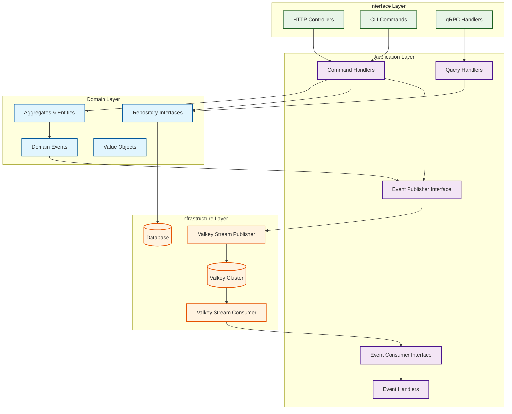

# Valkey Streams in Go: Implementation Guide for DDD, CQRS & Clean Architecture

> A comprehensive guide for implementing real-time streaming with Valkey in Go
> applications following Domain-Driven Design, CQRS, and Clean Architecture principles.

<!-- REF: https://dev.to/lovestaco/real-time-with-redis-streams-in-go-1hlh -->
<!-- REF: https://valkey.io/docs/ -->

## Overview

Valkey Streams provide a powerful mechanism for building real-time applications
with event streaming capabilities. This guide demonstrates how to integrate Valkey
Streams into Go applications while following our established architectural patterns
from the project guidelines.

## Why Valkey Streams?

- **100% Redis API Compatible**: Existing Redis Streams code works without modification
- **Open Source**: No licensing concerns compared to Redis
- **Better Long-term Sustainability**: Active development and community support
- **Performance**: Equivalent or better performance than Redis
- **Event Sourcing Support**: Natural fit for domain events and CQRS patterns

### Valkey Streams vs. Watermill: When to Choose Each

**Choose Valkey Streams (this guide) when:**

- You're committed to Valkey/Redis Streams as your messaging technology
- You want explicit Clean Architecture/DDD/CQRS implementation with architectural boundaries
- You need fine-grained control over message processing and Valkey-specific features
- Security-first repository design patterns are important
- You're building domain-rich applications with complex business rules
- You want to migrate from Redis to Valkey with minimal changes

**Choose [Watermill](https://watermill.io/) when:**

- You want messaging technology flexibility (Kafka, NATS, RabbitMQ, etc.)
- You need production-ready features out of the box (retry, circuit breaker, metrics)
- You're building event-driven microservices rapidly
- You want to experiment with different message brokers
- You need comprehensive middleware support for cross-cutting concerns
- You're building message-heavy applications with simpler domain logic

**Hybrid Approach:**

You can combine both by implementing Watermill's Publisher/Subscriber interfaces
using Valkey Streams as the underlying technology, gaining Watermill's middleware
ecosystem while maintaining Valkey-specific optimizations.

## Core Concepts

### Valkey Streams Fundamentals

- **Stream**: Append-only log of entries with unique IDs
- **Consumer Groups**: Multiple consumers can process stream entries in parallel
- **Consumer**: Individual processor within a consumer group
- **Entry**: Single message in a stream with key-value pairs
- **Acknowledgment**: Confirmation that a message has been processed

### Integration with Our Architecture



## Implementation Guide

### 1. Domain Layer: Define Domain Events

Following our DDD principles, start by defining domain events:

```go
// domain/events.go
package domain

import (
    "encoding/json"
    "time"
)

// Base event interface
type DomainEvent interface {
    EventID() string
    EventType() string
    AggregateID() string
    OccurredAt() time.Time
    Payload() interface{}
}

// User domain events
type UserCreatedEvent struct {
    ID          string    `json:"id"`
    UserID      string    `json:"user_id"`
    Email       string    `json:"email"`
    Role        string    `json:"role"`
    CreatedAt   time.Time `json:"created_at"`
}

func (e UserCreatedEvent) EventID() string      { return e.ID }
func (e UserCreatedEvent) EventType() string    { return "user.created" }
func (e UserCreatedEvent) AggregateID() string  { return e.UserID }
func (e UserCreatedEvent) OccurredAt() time.Time { return e.CreatedAt }
func (e UserCreatedEvent) Payload() interface{} { return e }

// Training domain events
type TrainingScheduledEvent struct {
    ID          string    `json:"id"`
    TrainingID  string    `json:"training_id"`
    Title       string    `json:"title"`
    TrainerID   string    `json:"trainer_id"`
    ScheduledAt time.Time `json:"scheduled_at"`
    CreatedAt   time.Time `json:"created_at"`
}

func (e TrainingScheduledEvent) EventID() string      { return e.ID }
func (e TrainingScheduledEvent) EventType() string    { return "training.scheduled" }
func (e TrainingScheduledEvent) AggregateID() string  { return e.TrainingID }
func (e TrainingScheduledEvent) OccurredAt() time.Time { return e.CreatedAt }
func (e TrainingScheduledEvent) Payload() interface{} { return e }
```

### 2. Application Layer: Event Publisher Interface

Define the port (interface) in the application layer:

```go
// application/ports/event_publisher.go
package ports

import (
    "context"
    "your-project/internal/domain"
)

// EventPublisher defines the port for publishing domain events
type EventPublisher interface {
    Publish(ctx context.Context, streamName string, event domain.DomainEvent) error
    PublishBatch(ctx context.Context, streamName string, events []domain.DomainEvent) error
}

// EventConsumer defines the port for consuming events
type EventConsumer interface {
    Subscribe(ctx context.Context, streamName, consumerGroup string, handler EventHandler) error
    CreateConsumerGroup(ctx context.Context, streamName, consumerGroup string) error
}

// EventHandler processes consumed events
type EventHandler interface {
    Handle(ctx context.Context, eventType string, data map[string]interface{}) error
}
```

### 3. Infrastructure Layer: Valkey Streams Implementation

Implement the adapter for Valkey Streams:

```go
// infrastructure/valkey/stream_publisher.go
package valkey

import (
    "context"
    "encoding/json"
    "fmt"
    "time"

    "github.com/redis/go-redis/v9"
    "your-project/internal/application/ports"
    "your-project/internal/domain"
)

type StreamPublisher struct {
    client *redis.Client
}

func NewStreamPublisher(client *redis.Client) ports.EventPublisher {
    return &StreamPublisher{client: client}
}

// Publish implements idempotent event publishing
func (p *StreamPublisher) Publish(ctx context.Context, streamName string, event domain.DomainEvent) error {
    // Check if event was already published (idempotency)
    exists, err := p.client.Exists(ctx, fmt.Sprintf("published:%s", event.EventID())).Result()
    if err != nil {
        return fmt.Errorf("checking event existence: %w", err)
    }
    if exists > 0 {
        return nil // Event already published
    }

    // Serialize event payload
    payload, err := json.Marshal(event.Payload())
    if err != nil {
        return fmt.Errorf("marshaling event payload: %w", err)
    }

    // Use pipeline for atomic operations
    pipe := p.client.Pipeline()

    // Add to stream
    pipe.XAdd(ctx, &redis.XAddArgs{
        Stream: streamName,
        ID:     event.EventID(), // Use event ID as stream entry ID
        Values: map[string]interface{}{
            "event_type":   event.EventType(),
            "aggregate_id": event.AggregateID(),
            "occurred_at":  event.OccurredAt().Format(time.RFC3339),
            "payload":      string(payload),
        },
    })

    // Mark as published for idempotency
    pipe.Set(ctx, fmt.Sprintf("published:%s", event.EventID()), "1", 24*time.Hour)

    _, err = pipe.Exec(ctx)
    if err != nil {
        return fmt.Errorf("publishing event to stream: %w", err)
    }

    return nil
}

func (p *StreamPublisher) PublishBatch(ctx context.Context, streamName string, events []domain.DomainEvent) error {
    if len(events) == 0 {
        return nil
    }

    pipe := p.client.Pipeline()

    for _, event := range events {
        // Check idempotency
        exists, err := p.client.Exists(ctx, fmt.Sprintf("published:%s", event.EventID())).Result()
        if err != nil {
            return fmt.Errorf("checking event existence: %w", err)
        }
        if exists > 0 {
            continue // Skip already published events
        }

        payload, err := json.Marshal(event.Payload())
        if err != nil {
            return fmt.Errorf("marshaling event payload: %w", err)
        }

        pipe.XAdd(ctx, &redis.XAddArgs{
            Stream: streamName,
            ID:     event.EventID(),
            Values: map[string]interface{}{
                "event_type":   event.EventType(),
                "aggregate_id": event.AggregateID(),
                "occurred_at":  event.OccurredAt().Format(time.RFC3339),
                "payload":      string(payload),
            },
        })

        pipe.Set(ctx, fmt.Sprintf("published:%s", event.EventID()), "1", 24*time.Hour)
    }

    _, err := pipe.Exec(ctx)
    if err != nil {
        return fmt.Errorf("publishing batch events: %w", err)
    }

    return nil
}
```

### 4. Event Consumer Implementation

```go
// infrastructure/valkey/stream_consumer.go
package valkey

import (
    "context"
    "encoding/json"
    "fmt"
    "log"
    "time"

    "github.com/redis/go-redis/v9"
    "your-project/internal/application/ports"
)

type StreamConsumer struct {
    client *redis.Client
}

func NewStreamConsumer(client *redis.Client) ports.EventConsumer {
    return &StreamConsumer{client: client}
}

func (c *StreamConsumer) CreateConsumerGroup(ctx context.Context, streamName, consumerGroup string) error {
    // Create consumer group starting from the beginning
    err := c.client.XGroupCreate(ctx, streamName, consumerGroup, "0").Err()
    if err != nil && err.Error() != "BUSYGROUP Consumer Group name already exists" {
        return fmt.Errorf("creating consumer group: %w", err)
    }
    return nil
}

func (c *StreamConsumer) Subscribe(ctx context.Context, streamName, consumerGroup string, handler ports.EventHandler) error {
    consumerName := fmt.Sprintf("consumer-%d", time.Now().Unix())

    for {
        select {
        case <-ctx.Done():
            return ctx.Err()
        default:
            // Read from stream with consumer group
            streams, err := c.client.XReadGroup(ctx, &redis.XReadGroupArgs{
                Group:    consumerGroup,
                Consumer: consumerName,
                Streams:  []string{streamName, ">"},
                Count:    10,
                Block:    time.Second,
            }).Result()

            if err != nil {
                if err == redis.Nil {
                    continue // No messages, continue polling
                }
                log.Printf("Error reading from stream: %v", err)
                time.Sleep(time.Second)
                continue
            }

            for _, stream := range streams {
                for _, message := range stream.Messages {
                    if err := c.processMessage(ctx, streamName, consumerGroup, message, handler); err != nil {
                        log.Printf("Error processing message %s: %v", message.ID, err)
                        // In production, consider implementing retry logic or dead letter queue
                    }
                }
            }
        }
    }
}

func (c *StreamConsumer) processMessage(ctx context.Context, streamName, consumerGroup string, msg redis.XMessage, handler ports.EventHandler) error {
    // Extract event data
    eventType, ok := msg.Values["event_type"].(string)
    if !ok {
        return fmt.Errorf("missing or invalid event_type")
    }

    // Convert payload back to map for handler
    payloadStr, ok := msg.Values["payload"].(string)
    if !ok {
        return fmt.Errorf("missing or invalid payload")
    }

    var payloadData map[string]interface{}
    if err := json.Unmarshal([]byte(payloadStr), &payloadData); err != nil {
        return fmt.Errorf("unmarshaling payload: %w", err)
    }

    // Add metadata to the data
    data := map[string]interface{}{
        "event_id":     msg.ID,
        "event_type":   eventType,
        "aggregate_id": msg.Values["aggregate_id"],
        "occurred_at":  msg.Values["occurred_at"],
        "payload":      payloadData,
    }

    // Process the event
    if err := handler.Handle(ctx, eventType, data); err != nil {
        return fmt.Errorf("handling event: %w", err)
    }

    // Acknowledge the message
    if err := c.client.XAck(ctx, streamName, consumerGroup, msg.ID).Err(); err != nil {
        return fmt.Errorf("acknowledging message: %w", err)
    }

    return nil
}
```

### 5. Application Layer: Command Handlers with Event Publishing

Integrate event publishing into command handlers following CQRS patterns:

```go
// application/command/create_user_handler.go
package command

import (
    "context"
    "fmt"

    "your-project/internal/application/ports"
    "your-project/internal/domain"
)

type CreateUserHandler struct {
    userRepo       domain.UserRepository
    eventPublisher ports.EventPublisher
}

func NewCreateUserHandler(userRepo domain.UserRepository, eventPublisher ports.EventPublisher) *CreateUserHandler {
    return &CreateUserHandler{
        userRepo:       userRepo,
        eventPublisher: eventPublisher,
    }
}

func (h *CreateUserHandler) Handle(ctx context.Context, cmd CreateUserCommand) error {
    // Validate and create domain objects (from project guidelines)
    email, err := domain.NewEmail(cmd.Email)
    if err != nil {
        return err
    }

    password, err := domain.NewPassword(cmd.Password)
    if err != nil {
        return err
    }

    // Create user aggregate
    user := domain.NewUser(email, password, domain.UserRole(cmd.Role))

    // Persist the user
    if err := h.userRepo.Save(ctx, user); err != nil {
        return fmt.Errorf("saving user: %w", err)
    }

    // Publish domain event
    event := domain.UserCreatedEvent{
        ID:        fmt.Sprintf("user-created-%s", user.ID.String()),
        UserID:    user.ID.String(),
        Email:     string(user.Email),
        Role:      string(user.Role),
        CreatedAt: user.CreatedAt,
    }

    if err := h.eventPublisher.Publish(ctx, "user-events", event); err != nil {
        // Log error but don't fail the command
        // Consider implementing eventual consistency patterns
        log.Printf("Failed to publish user created event: %v", err)
    }

    return nil
}
```

### 6. Event Handlers for Cross-Boundary Communication

Implement event handlers for reacting to domain events:

```go
// application/event_handlers/notification_handler.go
package event_handlers

import (
    "context"
    "encoding/json"
    "fmt"
    "log"

    "your-project/internal/application/ports"
)

type NotificationHandler struct {
    emailService ports.EmailService
}

func NewNotificationHandler(emailService ports.EmailService) ports.EventHandler {
    return &NotificationHandler{emailService: emailService}
}

func (h *NotificationHandler) Handle(ctx context.Context, eventType string, data map[string]interface{}) error {
    switch eventType {
    case "user.created":
        return h.handleUserCreated(ctx, data)
    case "training.scheduled":
        return h.handleTrainingScheduled(ctx, data)
    default:
        log.Printf("Unknown event type: %s", eventType)
        return nil
    }
}

func (h *NotificationHandler) handleUserCreated(ctx context.Context, data map[string]interface{}) error {
    payload, ok := data["payload"].(map[string]interface{})
    if !ok {
        return fmt.Errorf("invalid payload format")
    }

    email, ok := payload["email"].(string)
    if !ok {
        return fmt.Errorf("missing email in payload")
    }

    // Send welcome email
    return h.emailService.SendWelcomeEmail(ctx, email)
}

func (h *NotificationHandler) handleTrainingScheduled(ctx context.Context, data map[string]interface{}) error {
    payload, ok := data["payload"].(map[string]interface{})
    if !ok {
        return fmt.Errorf("invalid payload format")
    }

    trainingID, ok := payload["training_id"].(string)
    if !ok {
        return fmt.Errorf("missing training_id in payload")
    }

    title, ok := payload["title"].(string)
    if !ok {
        return fmt.Errorf("missing title in payload")
    }

    // Notify interested users about new training
    return h.emailService.NotifyTrainingScheduled(ctx, trainingID, title)
}
```

### 7. Dependency Injection and Wiring

Wire everything together in your main application:

```go
// cmd/api/main.go
package main

import (
    "context"
    "log"
    "os"
    "os/signal"
    "syscall"

    "github.com/redis/go-redis/v9"
    "your-project/internal/application/command"
    "your-project/internal/application/event_handlers"
    "your-project/internal/infrastructure/valkey"
)

func main() {
    // Initialize Valkey client
    valkeyClient := redis.NewClient(&redis.Options{
        Addr: "localhost:6379", // Valkey server address
    })

    // Test connection
    if err := valkeyClient.Ping(context.Background()).Err(); err != nil {
        log.Fatalf("Failed to connect to Valkey: %v", err)
    }

    // Initialize infrastructure
    eventPublisher := valkey.NewStreamPublisher(valkeyClient)
    eventConsumer := valkey.NewStreamConsumer(valkeyClient)

    // Initialize repositories (from your existing code)
    userRepo := infrastructure.NewPostgresUserRepository(db)

    // Initialize command handlers
    createUserHandler := command.NewCreateUserHandler(userRepo, eventPublisher)

    // Initialize event handlers
    notificationHandler := event_handlers.NewNotificationHandler(emailService)

    // Create consumer groups
    ctx := context.Background()
    if err := eventConsumer.CreateConsumerGroup(ctx, "user-events", "notification-service"); err != nil {
        log.Fatalf("Failed to create consumer group: %v", err)
    }

    // Start event consumers
    go func() {
        if err := eventConsumer.Subscribe(ctx, "user-events", "notification-service", notificationHandler); err != nil {
            log.Printf("Event consumer error: %v", err)
        }
    }()

    // Start your HTTP server here...

    // Graceful shutdown
    c := make(chan os.Signal, 1)
    signal.Notify(c, os.Interrupt, syscall.SIGTERM)
    <-c

    log.Println("Shutting down...")
    valkeyClient.Close()
}
```

## Advanced Patterns

### 1. Event Sourcing Integration

Combine Valkey Streams with event sourcing:

```go
// Event store using Valkey Streams
type EventStore struct {
    client *redis.Client
}

func (es *EventStore) SaveEvents(ctx context.Context, aggregateID string, events []domain.DomainEvent, expectedVersion int) error {
    streamName := fmt.Sprintf("aggregate:%s", aggregateID)

    // Check current version for optimistic concurrency control
    length, err := es.client.XLen(ctx, streamName).Result()
    if err != nil {
        return err
    }

    if int(length) != expectedVersion {
        return domain.ErrConcurrencyConflict
    }

    // Save events atomically
    pipe := es.client.Pipeline()
    for _, event := range events {
        payload, _ := json.Marshal(event.Payload())
        pipe.XAdd(ctx, &redis.XAddArgs{
            Stream: streamName,
            Values: map[string]interface{}{
                "event_type": event.EventType(),
                "payload":    string(payload),
                "version":    length + 1,
            },
        })
        length++
    }

    _, err = pipe.Exec(ctx)
    return err
}
```

### 2. Saga Pattern Implementation

Use Valkey Streams for coordinating distributed transactions:

```go
// Saga coordinator using streams
type SagaCoordinator struct {
    publisher ports.EventPublisher
    consumer  ports.EventConsumer
}

func (sc *SagaCoordinator) StartUserRegistrationSaga(ctx context.Context, userID string) error {
    sagaID := fmt.Sprintf("user-registration-%s", userID)

    // Publish saga started event
    event := domain.SagaStartedEvent{
        SagaID:   sagaID,
        SagaType: "user-registration",
        Data:     map[string]interface{}{"user_id": userID},
    }

    return sc.publisher.Publish(ctx, "saga-events", event)
}
```

### 3. Dead Letter Queue Pattern

Handle failed event processing:

```go
func (c *StreamConsumer) processMessage(ctx context.Context, streamName, consumerGroup string, msg redis.XMessage, handler ports.EventHandler) error {
    const maxRetries = 3

    // Get retry count from message
    retryCount := 0
    if retryStr, ok := msg.Values["retry_count"].(string); ok {
        retryCount, _ = strconv.Atoi(retryStr)
    }

    err := handler.Handle(ctx, eventType, data)
    if err != nil {
        if retryCount < maxRetries {
            // Requeue with increased retry count
            return c.requeueMessage(ctx, streamName, msg, retryCount+1)
        } else {
            // Send to dead letter queue
            return c.sendToDeadLetterQueue(ctx, msg, err)
        }
    }

    // Acknowledge successful processing
    return c.client.XAck(ctx, streamName, consumerGroup, msg.ID).Err()
}
```

## Testing Strategies

### 1. Unit Testing Event Handlers

```go
func TestNotificationHandler_HandleUserCreated(t *testing.T) {
    // Arrange
    mockEmailService := &mocks.EmailService{}
    handler := NewNotificationHandler(mockEmailService)

    data := map[string]interface{}{
        "payload": map[string]interface{}{
            "email": "test@example.com",
            "user_id": "123",
        },
    }

    mockEmailService.On("SendWelcomeEmail", mock.Anything, "test@example.com").Return(nil)

    // Act
    err := handler.Handle(context.Background(), "user.created", data)

    // Assert
    assert.NoError(t, err)
    mockEmailService.AssertExpectations(t)
}
```

### 2. Integration Testing with Testcontainers

```go
func TestStreamIntegration(t *testing.T) {
    // Start Valkey container
    ctx := context.Background()
    container, err := valkey.StartContainer(ctx)
    require.NoError(t, err)
    defer container.Terminate(ctx)

    // Get connection string
    connStr, err := container.ConnectionString(ctx)
    require.NoError(t, err)

    // Initialize client
    client := redis.NewClient(&redis.Options{Addr: connStr})

    // Test publishing and consuming
    publisher := NewStreamPublisher(client)
    consumer := NewStreamConsumer(client)

    // Test implementation...
}
```

## Performance Considerations

### 1. Stream Management

- **Set TTL on streams** to prevent unbounded growth
- **Use XTRIM** to limit stream length
- **Monitor memory usage** with Valkey monitoring tools

### 2. Consumer Group Optimization

- **Adjust consumer count** based on throughput requirements
- **Use appropriate block timeout** to balance latency and CPU usage
- **Implement backpressure** when consumers can't keep up

### 3. Monitoring and Observability

```go
// Add metrics to your event handlers
type InstrumentedEventHandler struct {
    handler ports.EventHandler
    metrics metrics.EventMetrics
}

func (h *InstrumentedEventHandler) Handle(ctx context.Context, eventType string, data map[string]interface{}) error {
    start := time.Now()
    defer func() {
        h.metrics.RecordProcessingTime(eventType, time.Since(start))
    }()

    h.metrics.IncrementEventProcessed(eventType)

    err := h.handler.Handle(ctx, eventType, data)
    if err != nil {
        h.metrics.IncrementEventFailed(eventType)
    }

    return err
}
```

## Security Considerations

### 1. Input Validation

Always validate event data before processing:

```go
func (h *NotificationHandler) validateUserCreatedEvent(data map[string]interface{}) error {
    payload, ok := data["payload"].(map[string]interface{})
    if !ok {
        return ErrInvalidPayload
    }

    email, ok := payload["email"].(string)
    if !ok || email == "" {
        return ErrMissingEmail
    }

    // Validate email format
    if !isValidEmail(email) {
        return ErrInvalidEmailFormat
    }

    return nil
}
```

### 2. Access Control

Implement proper authentication and authorization for stream access:

```go
// Use Valkey ACL for access control
func configureValkeyACL(client *redis.Client) error {
    // Create user with limited permissions
    return client.Do(context.Background(),
        "ACL", "SETUSER", "event-consumer",
        "on", ">password",
        "+@stream", "+@read",
        "~user-events*", "~training-events*").Err()
}
```

## Migration from Redis

Since Valkey is 100% API compatible with Redis, migrating existing Redis Streams code is straightforward:

1. **Update connection strings** to point to Valkey instances
2. **No code changes required** - all Redis commands work identically
3. **Test thoroughly** in a staging environment
4. **Monitor performance** to ensure equivalent or better behavior

## Best Practices Summary

1. **Follow Domain-Driven Design**: Keep domain events in the domain layer
2. **Implement Idempotency**: Prevent duplicate event processing
3. **Use Atomic Operations**: Ensure consistency with transactions
4. **Design for Failure**: Implement retry logic and dead letter queues
5. **Monitor Everything**: Add comprehensive metrics and logging
6. **Validate Inputs**: Always validate event data before processing
7. **Keep Events Small**: Use efficient serialization and avoid large payloads
8. **Version Your Events**: Plan for schema evolution
9. **Test Thoroughly**: Use both unit and integration tests
10. **Document Event Schemas**: Maintain clear contracts between services

## Conclusion

Valkey Streams provide a robust foundation for building event-driven architectures
in Go while maintaining compatibility with existing Redis-based systems. By
following the patterns outlined in this guide and integrating with our established
DDD, CQRS, and Clean Architecture principles, you can build scalable, maintainable,
and resilient real-time applications.

The combination of Valkey's performance and reliability with Go's simplicity and
our architectural patterns creates a powerful platform for modern distributed systems.
